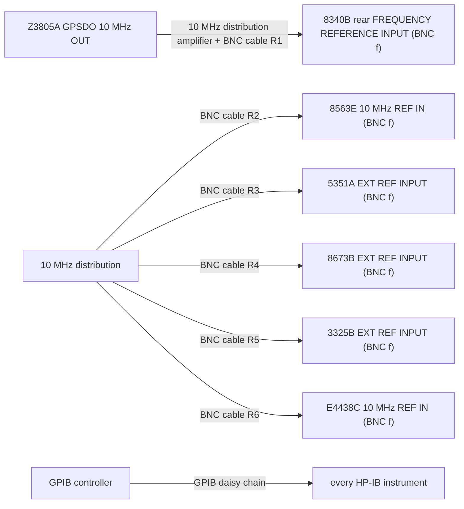
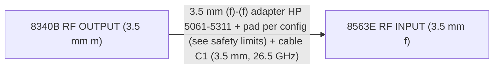
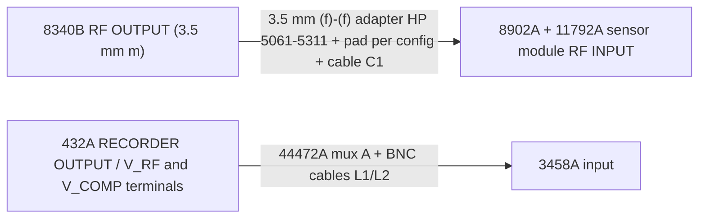
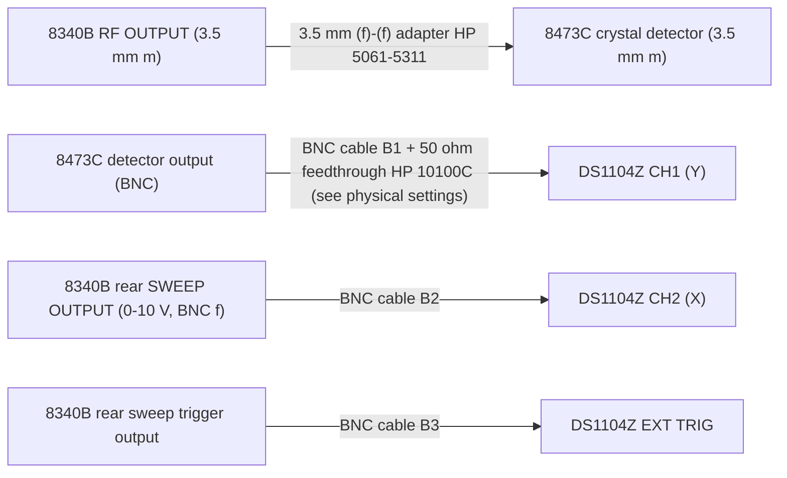
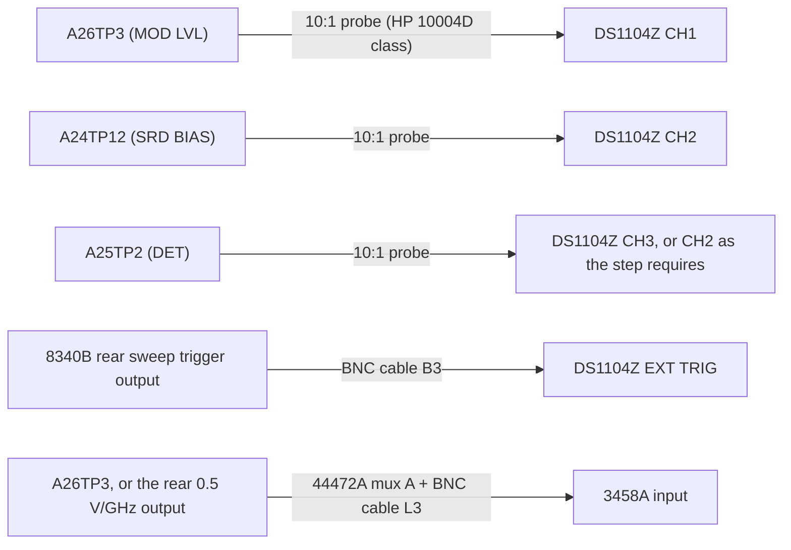
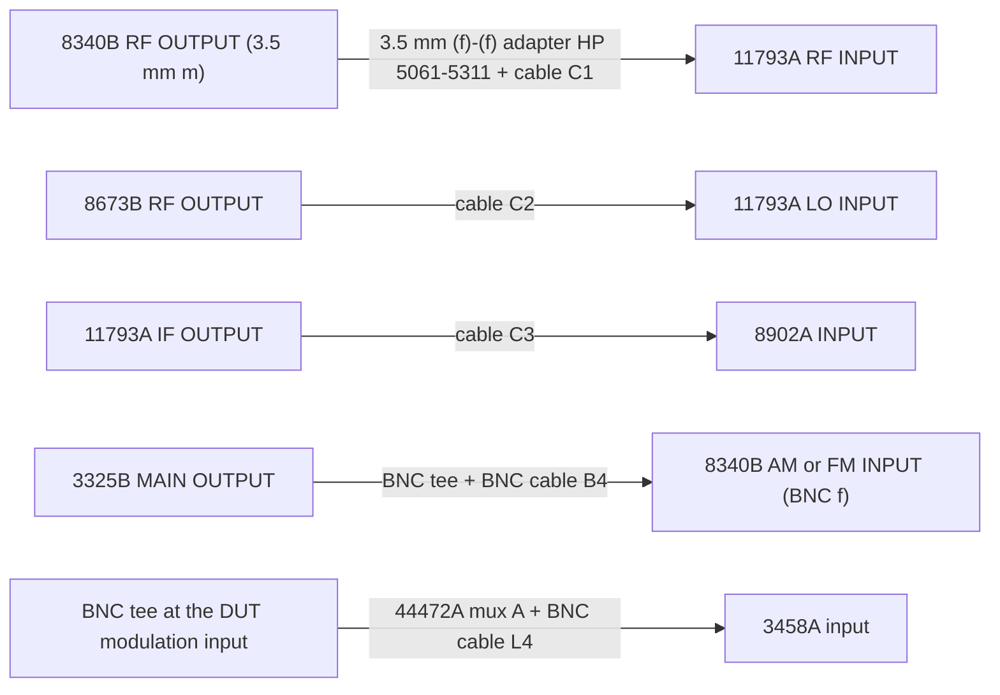
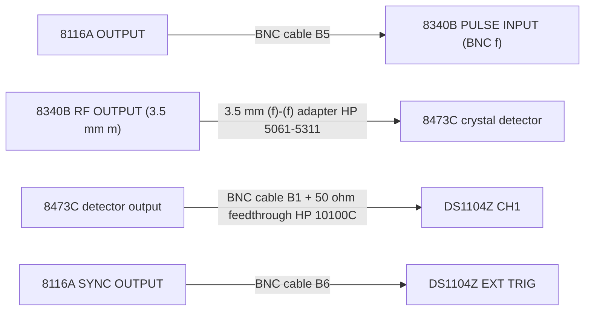
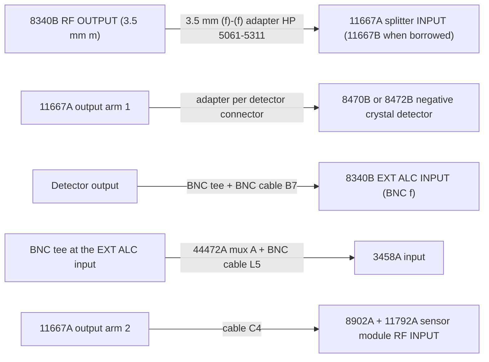
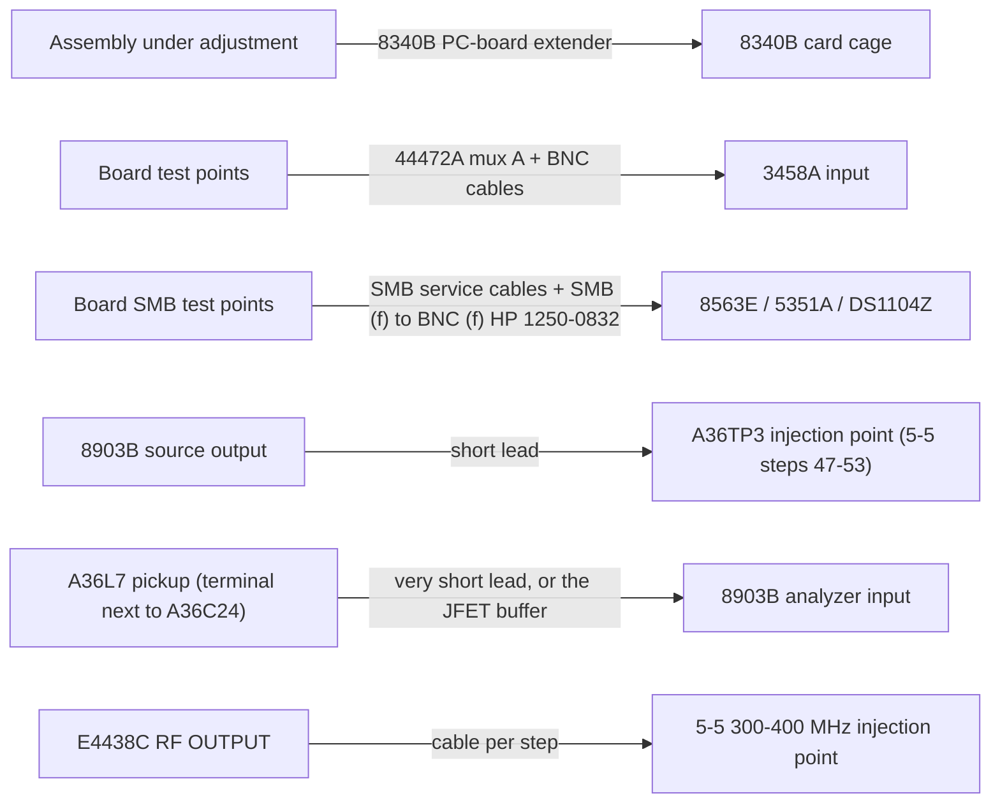

# Bench setups

Every measurement, test and guided procedure declares the `BenchSetup` it needs. When the
planner changes setup it shows the hook-up card for the new one; `hp8340b setup show <id>`
prints it on demand.

**This file is generated from `src/HP8340B.Bench/Data/setups.json`** so the documentation and
the app cannot drift apart. Edit the JSON, not this file. (Generation moves into the app in
issue M5-06; for now it is a script.)

Connector names marked **[verify-connector]** are placeholders taken from the service manual's
figures. They have not yet been checked against Section III of the operating manual or against
the instruments themselves.

## Index

| ID | Setup | Used by |
|---|---|---|
| [S0](#s0) | Standing configuration (never changes during a campaign) | Everything. Built once at the start of a campaign and left alone. |
| [S1](#s1) | DUT RF OUTPUT to 8563E spectrum analyzer | 4-7 and 4-8 spurious; squegging scans (M1-04/M1-05); zero-span checks (M1-07); SA envelop… |
| [S2](#s2) | DUT RF OUTPUT to 5351A microwave counter | 4-2 frequency range and CW accuracy; 4-4 swept frequency spot checks. |
| [S3](#s3) | DUT RF OUTPUT to power sensor | 4-5 power accuracy and flatness; 5-14 minimum-power confirmations (steps 15, 22, 30); 5-1… |
| [S4](#s4) | Crystal detector XY display on the DS1104Z (primary tuning view) | 5-14 SYTM tracking, unleveled SRD bias, delay compensation and DRP (steps 8-69); 5-16 lev… |
| [S5](#s5) | Scope probes on internal test points | 5-14 step 7 (0.5 V/GHz) and step 13 (A24TP12 slope); 5-16 steps 1-29 (modulator offset, l… |
| [S6](#s6) | 11793A microwave converter for AM/FM demodulation | 4-15 AM depth; 4-16 FM deviation accuracy via demodulation; 5-9 FM accuracy and overmod. |
| [S7](#s7) | Pulse modulation setup | 4-11 on/off ratio; 4-12 rise/fall; 4-13 pulse accuracy; 4-14 video feedthrough; 5-18 puls… |
| [S8](#s8) | External leveling with a power splitter | 4-6 external leveling; 5-15 steps 21-34 (external leveling, CC48, A25R80 EX-). |
| [S9](#s9) | Board-level service access | 5-1 to 5-13; 5-15 logger temperature compensation; 5-18 as needed. |
| [S10](#s10) | HP-IB only, no RF connections | Cal-constant backup, diff and restore; learn-string capture; 4-17 HP-IB operation verific… |

## S0

**Standing configuration (never changes during a campaign)**

Used by: Everything. Built once at the start of a campaign and left alone.

### Connections

- Z3805A GPSDO 10 MHz OUT → 10 MHz distribution amplifier → BNC cable R1 → 8340B rear FREQUENCY REFERENCE INPUT (BNC f)  **[verify-connector]**
- 10 MHz distribution → BNC cable R2 → 8563E 10 MHz REF IN (BNC f)  **[verify-connector]**
- 10 MHz distribution → BNC cable R3 → 5351A EXT REF INPUT (BNC f)  **[verify-connector]**
- 10 MHz distribution → BNC cable R4 → 8673B EXT REF INPUT (BNC f)  **[verify-connector]**
- 10 MHz distribution → BNC cable R5 → 3325B EXT REF INPUT (BNC f)  **[verify-connector]**
- 10 MHz distribution → BNC cable R6 → E4438C 10 MHz REF IN (BNC f)  **[verify-connector]**
- GPIB controller → GPIB daisy chain → every HP-IB instrument

### Physical settings (cannot be set over the bus)

- 8340B rear FREQUENCY REFERENCE switch to EXT.
- DUT in the test position with covers off for any Section V work.
- DUT warmed up at least 1 hour (5-14 step 1 allows half an hour for that procedure alone).
- DS1104Z on the LAN and reachable; confirm the address has not moved off 192.168.1.145.
- Run `probe` and confirm every instrument answers before starting a campaign.

### Safety limits

- The LINE switch has no OFF position: standby still applies power. See docs/SAFETY.md.
- Covers-off work is live-chassis work. Non-metallic tools only.

### Wiring self-check

Probe every configured instrument and read the DUT external-reference bit (extended status byte #2 bit 3, Table 4-31).

**Expect:** Every present instrument responds; the DUT reports external reference selected.

## S1

**DUT RF OUTPUT to 8563E spectrum analyzer**

Manual: Replaces the 8566B + LO + mixer setup of 5-14 steps 70-80 and 5-16 steps 37-50.

Used by: 4-7 and 4-8 spurious; squegging scans (M1-04/M1-05); zero-span checks (M1-07); SA envelope view (M2-03); point tuning meter (M2-04); phase noise via PN.EXE or the 85671A (4-9); AM/FM Bessel-null accuracy; 4-17 HP-IB verification (no RF needed).

### Connections

- 8340B RF OUTPUT (3.5 mm m) → 3.5 mm (f)-(f) adapter HP 5061-5311 → pad per config (see safety limits) → cable C1 (3.5 mm, 26.5 GHz) → 8563E RF INPUT (3.5 mm f)  **[verify-connector]**

### Physical settings (cannot be set over the bus)

- Pad value must be declared in config so it is subtracted from results (repo rule 5).
- 8563E input attenuation set by the driver, never 0 dB with a +10 dBm carrier present.

### Safety limits

- 8563E maximum input: check the front-panel label before connecting. Warn before any step that could put more than +10 dBm in without a pad (rule 5).
- Never connect the DUT unleveled at +20 dBm without a characterised pad.
- 8563E input DC limit is 0 V: use a DC block when probing any node carrying bias.
- Never drive the 8563E from this tool while PN.EXE or the 85671A utility is measuring (rule 5).

### Wiring self-check

DUT to CW 1 GHz at 0 dBm; peak-search the 8563E marker.

**Expect:** Marker reads 0 dBm +/- 2 dB, corrected for the declared pad.

## S2

**DUT RF OUTPUT to 5351A microwave counter**

Manual: Figure 4-2 (frequency range and CW accuracy).

Used by: 4-2 frequency range and CW accuracy; 4-4 swept frequency spot checks.

### Connections

- 8340B RF OUTPUT (3.5 mm m) → 3.5 mm (f)-(f) adapter HP 5061-5311 → pad per config → cable C1 → 5351A INPUT (band-appropriate connector)  **[verify-connector]**

### Physical settings (cannot be set over the bus)

- 5351A on the shared 10 MHz (S0). The counter and the DUT must share a reference or the test measures nothing.
- Select the 5351A input appropriate to the band under test.

### Safety limits

- 5351A maximum input: check the front-panel label. Warn above +10 dBm without a pad (rule 5).

### Wiring self-check

DUT to CW 1 GHz; read the 5351A.

**Expect:** 1.000000000 GHz to the counter resolution, both locked to the Z3805A.

## S3

**DUT RF OUTPUT to power sensor**

Manual: Figure 4-5 (maximum leveled output power and power accuracy test setup).

Used by: 4-5 power accuracy and flatness; 5-14 minimum-power confirmations (steps 15, 22, 30); 5-15 ALC accuracy (steps 15-20); 5-17 flatness constants; pad characterisation.

### Connections

- 8340B RF OUTPUT (3.5 mm m) → 3.5 mm (f)-(f) adapter HP 5061-5311 → pad per config → cable C1 → 8902A + 11792A sensor module RF INPUT  **[verify-connector]**
- 432A RECORDER OUTPUT / V_RF and V_COMP terminals → 44472A mux A → BNC cables L1/L2 → 3458A input  **[verify-connector]**

### Physical settings (cannot be set over the bus)

- Which sensor is in use is a config choice: 8902A+11792A (50 MHz-18 GHz), 437B + an 848x sensor (second automatable path), 8485A on the 437B or a borrowed U8485A for band 4, 432A+478A thermistor as the independent check below 10 GHz.
- 432A range and CAL FACTOR dials set by hand and recorded in the session.
- Zero and calibrate the 11792A against the 8902A 50 MHz calibrator before the block; zero and calibrate the 437B against its own 50 MHz 1 mW reference.

### Safety limits

- REFUSE any DUT setting above +7 dBm while the 478A thermistor mount is the selected sensor (10 mW rating) unless a characterised pad is declared (rule 5).
- REFUSE above +17 dBm while the 11792A or an 848x sensor is selected, unless a characterised pad is declared (rule 5). Per-sensor limits differ: an 8481A is -30 to +20 dBm, an 8482B reaches +44 dBm - the driver enforces the limit for the sensor actually configured.
- The 11792A covers 50 MHz-18 GHz only. Above 18 GHz results are Relative at best without a borrowed 26.5 GHz sensor.

### Wiring self-check

DUT to CW 1 GHz at 0 dBm; read the selected sensor.

**Expect:** Within +/- 0.5 dB of the DUT setting, corrected for the declared pad and cal factor.

## S4

**Crystal detector XY display on the DS1104Z (primary tuning view)**

Manual: Figure 5-40 (unleveled RF output adjustments setup), A-vs-B display.

Used by: 5-14 SYTM tracking, unleveled SRD bias, delay compensation and DRP (steps 8-69); 5-16 leveled bias bands 2-4 (steps 30-36); 4-5 max-leveled-power envelopes; 4-3 sweep time; 4-10 power sweep.

### Connections

- 8340B RF OUTPUT (3.5 mm m) → 3.5 mm (f)-(f) adapter HP 5061-5311 → 8473C crystal detector (3.5 mm m)  **[verify-connector]**
- 8473C detector output (BNC) → BNC cable B1 → 50 ohm feedthrough HP 10100C (see physical settings) → DS1104Z CH1 (Y)  **[verify-connector]**
- 8340B rear SWEEP OUTPUT (0-10 V, BNC f) → BNC cable B2 → DS1104Z CH2 (X)  **[verify-connector]**
- 8340B rear sweep trigger output → BNC cable B3 → DS1104Z EXT TRIG  **[verify-connector]**

### Physical settings (cannot be set over the bus)

- DS1104Z in XY mode, CH1 vs CH2.
- DS1104Z input is 1 Mohm only. Try 1 Mohm first; add the 50 ohm BNC feedthrough if the trace is slow or rings at AUTO sweep time.
- DS1104Z probe attenuation set to 1x for direct BNC connections.
- Detector polarity is negative on all three detectors here: confirm from the label (8470B, 8472B, 8473C).
- Run the M0-14 detector calibration so the XY trace can be shown in dB.

### Safety limits

- 8473C maximum input: check the detector label before applying unleveled +20 dBm.
- The detector is the only thing on the DUT output in this setup; nothing here is rated for the analyzer or sensor.

### Wiring self-check

DUT sweeping the band under test; capture one XY trace.

**Expect:** X spans the expected 0-10 V ramp and the detector output is negative-going.

## S5

**Scope probes on internal test points**

Manual: Figures 5-41 and the 5-16 adjustment location figures.

Used by: 5-14 step 7 (0.5 V/GHz) and step 13 (A24TP12 slope); 5-16 steps 1-29 (modulator offset, leveled bias waveforms, ALC loop gain).

### Connections

- A26TP3 (MOD LVL) → 10:1 probe (HP 10004D class) → DS1104Z CH1  **[verify-connector]**
- A24TP12 (SRD BIAS) → 10:1 probe → DS1104Z CH2  **[verify-connector]**
- A25TP2 (DET) → 10:1 probe → DS1104Z CH3, or CH2 as the step requires  **[verify-connector]**
- 8340B rear sweep trigger output → BNC cable B3 → DS1104Z EXT TRIG  **[verify-connector]**
- A26TP3, or the rear 0.5 V/GHz output → 44472A mux A → BNC cable L3 → 3458A input  **[verify-connector]**

### Physical settings (cannot be set over the bus)

- Covers off, DUT in the test position, extender boards as the step requires.
- Remove jumpers A28W1 and A28W2 before the 0.5 V/GHz adjustment (5-14 step 5).
- DS1104Z probe attenuation set to 10x to match the probes.
- 3458A NPLC per the step; the 0.5 V/GHz check wants 5 mV +/- 0.5 mV resolution.

### Safety limits

- Live chassis, covers off, power applied. Non-metallic tools. See docs/SAFETY.md.
- Do not route any biased test point through the 3499A RF tree: the microwave switches have a DC limit well below these nodes.

### Wiring self-check

Read the probed test point with the DUT in the state the step calls for.

**Expect:** The probe channel sees DC in the range the manual quotes for that test point.

## S6

**11793A microwave converter for AM/FM demodulation**

Manual: The 4-15 and 4-16 test setup figures.

Used by: 4-15 AM depth; 4-16 FM deviation accuracy via demodulation; 5-9 FM accuracy and overmod.

### Connections

- 8340B RF OUTPUT (3.5 mm m) → 3.5 mm (f)-(f) adapter HP 5061-5311 → cable C1 → 11793A RF INPUT  **[verify-connector]**
- 8673B RF OUTPUT → cable C2 → 11793A LO INPUT  **[verify-connector]**
- 11793A IF OUTPUT → cable C3 → 8902A INPUT  **[verify-connector]**
- 3325B MAIN OUTPUT → BNC tee → BNC cable B4 → 8340B AM or FM INPUT (BNC f)  **[verify-connector]**
- BNC tee at the DUT modulation input → 44472A mux A → BNC cable L4 → 3458A input  **[verify-connector]**

### Physical settings (cannot be set over the bus)

- 8673B LO frequency set per the 11793A conversion plan for the band under test.
- 3325B output level is the modulating voltage; the 3458A reads it so the applied drive is recorded, not assumed.

### Safety limits

- 11793A and 8902A maximum inputs: check both before connecting.
- DUT modulation inputs are low-level: do not drive them from the 8116A at full output.

### Wiring self-check

DUT to a CW carrier in the band; confirm the 8902A tunes to it.

**Expect:** The 8902A locks and shows the carrier at the expected level.

## S7

**Pulse modulation setup**

Manual: The 4-11 to 4-14 test setup figures.

Used by: 4-11 on/off ratio; 4-12 rise/fall; 4-13 pulse accuracy; 4-14 video feedthrough; 5-18 pulse adjustments.

### Connections

- 8116A OUTPUT → BNC cable B5 → 8340B PULSE INPUT (BNC f)  **[verify-connector]**
- 8340B RF OUTPUT (3.5 mm m) → 3.5 mm (f)-(f) adapter HP 5061-5311 → 8473C crystal detector  **[verify-connector]**
- 8473C detector output → BNC cable B1 → 50 ohm feedthrough HP 10100C → DS1104Z CH1  **[verify-connector]**
- 8116A SYNC OUTPUT → BNC cable B6 → DS1104Z EXT TRIG  **[verify-connector]**

### Physical settings (cannot be set over the bus)

- 8116A output enabled and its load setting matched to 50 ohm.
- DS1104Z CH1 must be 50 ohm terminated for the rise/fall measurement: the feedthrough is required here, not optional.
- Verify the 8116A transition-time and minimum-width specs against its own manual before trusting 4-12.
- On/off ratio is read on the 8563E, which is a brief S1 excursion.

### Safety limits

- 8116A output into the DUT pulse input: check the DUT input rating before raising the level.

### Wiring self-check

8116A producing a known pulse train; capture the detected envelope.

**Expect:** Pulse period and width on the scope match what the 8116A was told to produce.

## S8

**External leveling with a power splitter**

Manual: The 4-6 external leveling test setup figure, and 5-15 steps 21-34.

Used by: 4-6 external leveling; 5-15 steps 21-34 (external leveling, CC48, A25R80 EX-).

### Connections

- 8340B RF OUTPUT (3.5 mm m) → 3.5 mm (f)-(f) adapter HP 5061-5311 → 11667A splitter INPUT (11667B when borrowed)  **[verify-connector]**
- 11667A output arm 1 → adapter per detector connector → 8470B or 8472B negative crystal detector  **[verify-connector]**
- Detector output → BNC tee → BNC cable B7 → 8340B EXT ALC INPUT (BNC f)  **[verify-connector]**
- BNC tee at the EXT ALC input → 44472A mux A → BNC cable L5 → 3458A input  **[verify-connector]**
- 11667A output arm 2 → cable C4 → 8902A + 11792A sensor module RF INPUT  **[verify-connector]**

### Physical settings (cannot be set over the bus)

- 11667A is DC-18 GHz. Band 4 external leveling is NotPossible without the borrowed 11667B and a 26.5 GHz sensor.
- Detector polarity negative; 5-15 step 26 wants a positive detector and is skipped (none on hand).
- DC bias points for 5-15 come from the 8116A or DG1032Z DC output, monitored by the 3458A.

### Safety limits

- Splitter arms halve the power; account for that before assuming a sensor is safe.
- The 478A mount limit of +7 dBm still applies on whichever arm feeds it.

### Wiring self-check

DUT at a known level; read both splitter arms.

**Expect:** The two arms track each other within the splitter stated balance, and the detector output is negative.

## S9

**Board-level service access**

Manual: The Section V adjustment location figures.

Used by: 5-1 to 5-13; 5-15 logger temperature compensation; 5-18 as needed.

### Connections

- Assembly under adjustment → 8340B PC-board extender → 8340B card cage  **[verify-connector]**
- Board test points → 44472A mux A → BNC cables → 3458A input  **[verify-connector]**
- Board SMB test points → SMB service cables → SMB (f) to BNC (f) HP 1250-0832 → 8563E / 5351A / DS1104Z  **[verify-connector]**
- 8903B source output → short lead → A36TP3 injection point (5-5 steps 47-53)  **[verify-connector]**
- A36L7 pickup (terminal next to A36C24) → very short lead, or the JFET buffer → 8903B analyzer input  **[verify-connector]**
- E4438C RF OUTPUT → cable per step → 5-5 300-400 MHz injection point  **[verify-connector]**

### Physical settings (cannot be set over the bus)

- Extender boards as each adjustment requires.
- 8903B FLOAT switch and input impedance set per M2-09; 80 kHz low-pass ON, 30 kHz low-pass OFF for the 50 kHz null.
- For 5-5 step 48: use a very short lead and check whether adding ~10 pF at the pickup moves the null. If it does, put the JFET buffer in the signal path.

### Safety limits

- Live chassis, covers off, power applied. Non-metallic tools. Do not force slug-tuned parts.
- Extender boards expose supply rails: do not short adjacent pins with a probe ground clip.

### Wiring self-check

Read the first test point the adjustment calls for.

**Expect:** Within the range the manual quotes for that node before adjustment.

## S10

**HP-IB only, no RF connections**

Manual: Figure 4-22 (HP-IB operation verification test setup).

Used by: Cal-constant backup, diff and restore; learn-string capture; 4-17 HP-IB operation verification.

### Connections

- GPIB controller → GPIB cable → 8340B HP-IB connector

### Physical settings (cannot be set over the bus)

- No RF connections required. The DUT RF output may be left terminated or capped.
- This is the setup for every write to the instrument, so it is where a campaign starts and ends.

### Safety limits

- Repo rule 1: no write to the 8340B without explicit per-action confirmation. Never in a background loop.
- The store-to-protected-memory sequence overwrites the protected cal-constant copy. Back up over HP-IB first; the printed card under the top cover is the last resort.

### Wiring self-check

Serial-poll the DUT and read status byte #1.

**Expect:** The DUT responds and reports no HP-IB syntax error (bit 5 clear).

## Routed setups SR and SV

The 3499A lets one physical build serve S1, S2, S3 and the detector leg of S4, so the planner
treats those as one setup with switch changes as zero-cost, logged transitions.

The RF tree (SR) and the LF multiplexers (SV) are **not yet in this data file** — defining them
is issue M0-22, and the slot/channel map has to be confirmed against the actual module
inventory first (decision issue M5-07). The rules they must follow:

1. Legs through a 33311B are usable to 18 GHz; the two 33311C legs reach 26.5 GHz. In band 4
   and 18–20 GHz the planner schedules direct-connection excursions for the 18 GHz legs. The
   tool must refuse to report a band-4 result taken through an 18 GHz leg as `Spec`.
2. Matrix calibration at the start of a campaign, and whenever a cable is moved: per leg,
   measure the DUT direct against through-the-tree across a frequency grid with the sensor as
   reference. Store loss against frequency with a date and an uncertainty. Stale calibration
   blocks `Spec`-class results until redone.
3. **Never hot-switch.** Set `RF0`, change the switch, confirm the state readback, then `RF1`.
4. The hook-up cards list every leg with its cable label, module slot and channel numbers,
   which legs are 18 GHz-limited, the DC limit of the microwave switches (no biased nodes
   through the RF tree) and their 1 W average rating.
5. Final 4-5 power-accuracy results may be taken direct as well as through the tree; when both
   exist, the direct result is the one reported.
6. Matrix calibration covers the RF legs; the SV legs need only a continuity and offset check
   at campaign start.
